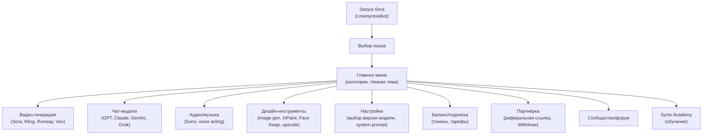
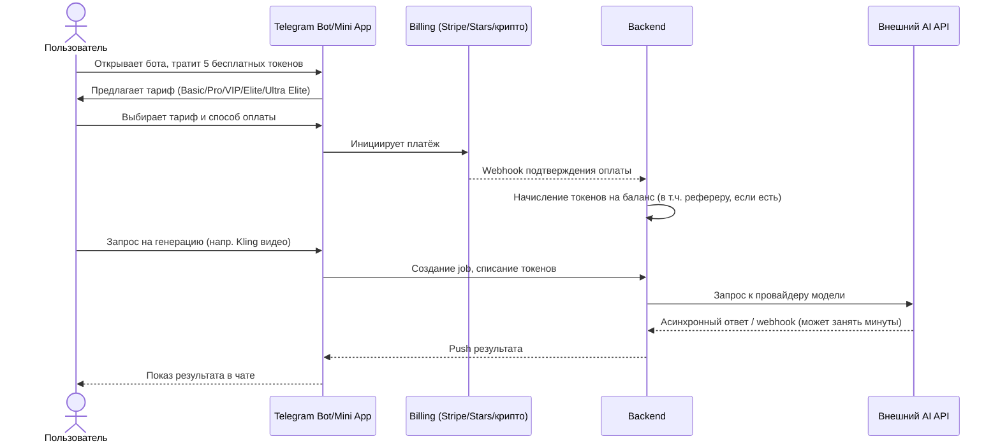

# Этап 1 — Reverse Engineering продукта SYNTX

> Методология: SYNTX не раскрывает код, инфраструктуру или контракты с провайдерами. Раздел построен на первичных источниках — сайт syntx.ai, его публичная оферта/условия, Telegram-бот, LinkedIn компании и вакансии, сторонние обзоры/директории и отзывы. Архитектурные выводы, помеченные **[EST]**, — это реконструкция по типовым паттернам индустрии AI-агрегаторов, а не подтверждённый факт устройства бэкенда SYNTX.

## 1.1 Что такое SYNTX — позиционирование

SYNTX — "AI-агрегатор": **"90+ AI Models in One Place"**, единая подписка вместо десятков отдельных подписок на ChatGPT, Midjourney, Suno и т.д. Доступ — через веб-приложение (syntx.ai) и Telegram-бота **[@syntxaibot](https://t.me/syntxaibot)**. **[FACT]**, источник: [syntx.ai](https://syntx.ai/), [traksource.com обзор](https://traksource.com/syntx-ai-review/).

Целевая аудитория, по описанию сайта и обзоров: фрилансеры, маркетологи, дизайнеры, SMM-менеджеры, мультимодальные создатели контента. Явно НЕ таргетирует разработчиков, которым нужен прямой API-доступ — обзоры отмечают отсутствие публичного API как ограничение. **[FACT]**, источники: [traksource.com](https://traksource.com/syntx-ai-review/), [trackertools.org](https://trackertools.org/tools/syntx-ai/).

## 1.2 Юридическое лицо и компания

- **Юрлицо:** SYNTX INTELLIGENCE – FZCO, ОАЭ, рег. № 70517, зарегистрировано 21 октября 2025, адрес Dubai Digital Park, Dubai Silicon Oasis. **[FACT]**, источник: [syntx.ai/public-offer](https://syntx.ai/public-offer).
- **Операционный офис:** Рига, Латвия — по данным LinkedIn компании и вакансии (требуется знание русского/латышского/английского). **[FACT]**, источники: [LinkedIn компании](https://www.linkedin.com/company/syntx-ai), [вакансия Business Assistant](https://lv.linkedin.com/jobs/view/business-assistant-at-syntx-ai-4226301687).
- **Несоответствие:** регистрация в ОАЭ датирована октябрём 2025, при этом продукт (судя по объёму отзывов и 369,801 MAU бота) существенно старше этой даты — похоже на позднюю юридическую реструктуризацию, а не на дату запуска продукта. Точная дата запуска — **[UNKNOWN]**.
- **Команда:** LinkedIn показывает диапазон 51–200 сотрудников, видимо 73 профиля. Открытые вакансии — backend-разработчики, DevOps, UX/UI, sales. **[FACT]**.
- **Основатель:** упомянут Arturs Jansons в руководстве, но точная роль/биография — **[UNKNOWN]**. Раунды финансирования/инвесторы — **[UNKNOWN]**, ни Crunchbase, ни Tracxn профиля не найдено.
- **Заявленный масштаб:** "более 1 млн результатов генерации в сутки", "сотни тысяч пользователей", отдельно вакансия называет цифру "более 700,000 пользователей". Источник — собственные материалы компании, независимого подтверждения нет. **[FACT/самозаявление]**.
- **Важно:** существует как минимум два не связанных с SYNTX AI бренда с похожим названием — стартап "SyntX" (AI coding assistant, Индия, github.com/OrangeCat-Technologies/SyntX, syntx.dev) и агентство "Syntx" на Clutch (США). Не путать при дальнейшем поиске.

## 1.3 Реконструкция архитектуры (по внешним признакам) — **[EST]**

Прямых технических данных (API-доки, GitHub, стек в вакансиях) не найдено. Ниже — заключение по косвенным признакам:

| Признак | Что он говорит об архитектуре |
|---|---|
| Бот имеет generation queue с задержками (жалоба в Trustpilot: "несколько часов на 10-секундную генерацию"; ответ компании про обновление модели и время генерации "3-4 минуты") | Существует асинхронная очередь генераций с поллингом статуса — то есть архитектура **request → queue → worker → callback/poll**, а не синхронный проксирующий вызов |
| Указана зависимость от сторонних API как риск ("outages affect availability" — traksource.com) | Подтверждает, что SYNTX — **агрегатор/реселлер**, а не собственные модели/GPU-инфраструктура на большинстве функций |
| Токены не тратятся на LLM-чат, но тратятся на генерацию медиа; часть инструментов "unlimited" | Экономика продукта явно разделяет **дешёвые операции (текст)** и **дорогие операции (медиа)** — типичный признак того, что стоимость по чату для SYNTX околонулевая (кэш/дешёвые модели) относительно продажной цены |
| Оплата: Stripe, Telegram Stars, крипто, "Overpay" | Мультипровайдерный биллинг — вероятно, отдельный billing-слой, агрегирующий несколько платёжных рельсов; нет специфичной локализации под Индонезию (QRIS/e-wallets не упоминаются) |
| Реферальная система с начислением токенов "в течение 10 минут после подтверждённого платежа" | Есть вебхук-обработка платежей с последующим начислением в near-real-time — обычный паттерн (payment webhook → ledger credit) |
| FAQ: токены сохраняются после окончания подписки, но использовать их можно только при активной подписке | Баланс токенов и статус подписки — раздельные сущности в БД, gate на списание завязан на оба поля |
| Web-версия "ограниченный набор инструментов" против "полного функционала" в Telegram | Telegram Mini App/Bot — это основной, наиболее развитый клиент; веб — вторичный/upsell-канал |

**Вывод [EST]:** архитектура, скорее всего, близка к монолитному backend + очередь задач + мультипровайдерные интеграции с внешними AI API, без выраженного собственного GPU-парка (весь риск "outage у провайдера" был бы неактуален при собственных моделях). Признаков собственного inference (веб-сокеты для realtime-генерации, кастомные модели, дообученные веса) не найдено.

## 1.4 Информационная архитектура / Screen Map (Telegram Mini App, по обзору findmini.app)

Реконструировано по стороннему обзору с описанием скриншотов **[FACT со ссылкой на вторичный источник]**, источник: [findmini.app/read/review_syntxaibot](https://www.findmini.app/read/review_syntxaibot/):

## 1.5 User Flow — покупка подписки и генерация (реконструкция)

## 1.6 Customer Journey (по совокупности источников)

1. **Открытие** — реферальная ссылка, Telegram-реклама, обзорные YouTube-видео ("I Replaced 10 AI Tools with ONE Platform"), поисковые/директорийные листинги (Toolify, ToolFi, TheresAnAIForThat).
2. **Trial** — 5 бесплатных токенов + 5 бесплатных LLM-запросов без оплаты.
3. **Конверсия** — апселл на Basic/Pro при упоре в лимит токенов; полноценный доступ к unlimited LLM начинается с VIP.
4. **Использование** — преимущественно медиа-генерация (видео/фото), т.к. именно она токеноёмкая; чат позиционируется как "приманка" (не тратит токены на части моделей).
5. **Удержание** — реферальная программа (доля от платежей приглашённого, включая продления), Academy-контент, community/форум.
6. **Риск оттока** — жалобы на скорость генерации видео (часы вместо минут) и на несоответствие заявленного тарифа фактическому доступу к модели ("elite membership... получил старую Sora") — прямая угроза retention и репутации.

## 1.7 Ключевые находки для дальнейших этапов

- **Нет публичного API** → нельзя реплицировать через партнёрство/интеграцию, только через создание собственного продукта.
- **Явная зависимость от сторонних провайдеров** → себестоимость SYNTX по сути равна отраслевым ценам на API (см. Этап 4) + их наценка (см. Этап 6).
- **Слабая независимая верификация масштаба** (Trustpilot — 4 отзыва, iOS-приложение с рейтингом 1.0/2 оценки при заявленных 700k+ пользователей) — установленный разрыв между PR-заявлениями и внешне проверяемым следом, важно для инвестиционных выводов (см. `executive-summary.md`).
- **Индонезийская локализация отсутствует** — нет упоминаний Bahasa Indonesia, QRIS, GoPay/OVO/DANA/ShopeePay в платёжных методах SYNTX — прямое окно возможностей (см. `10-recommendations.md`).
