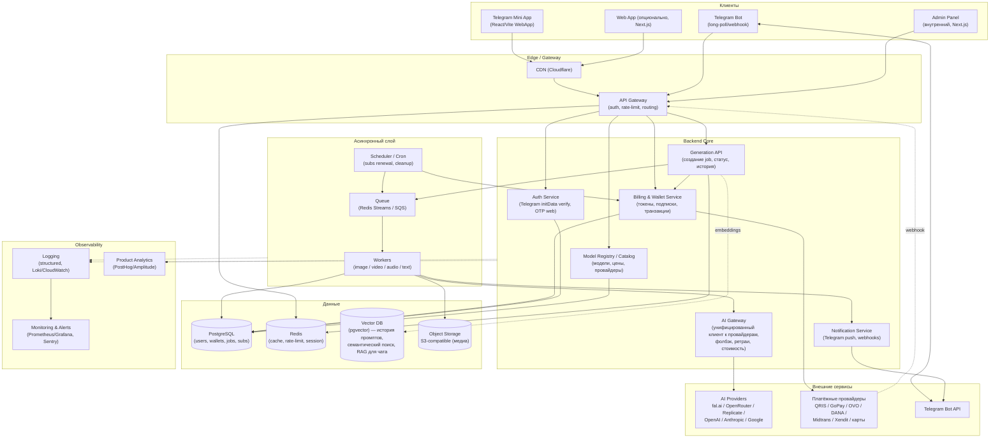
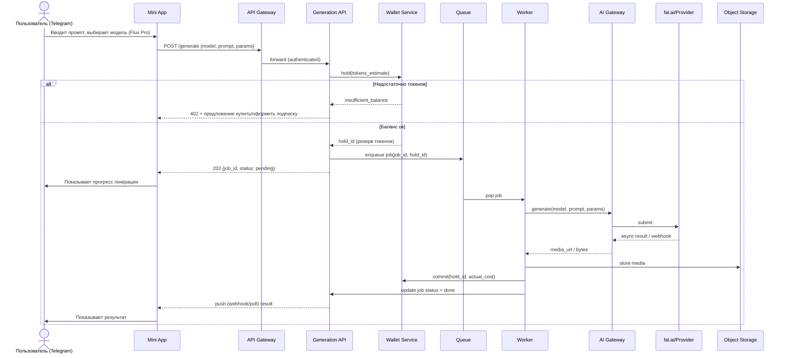
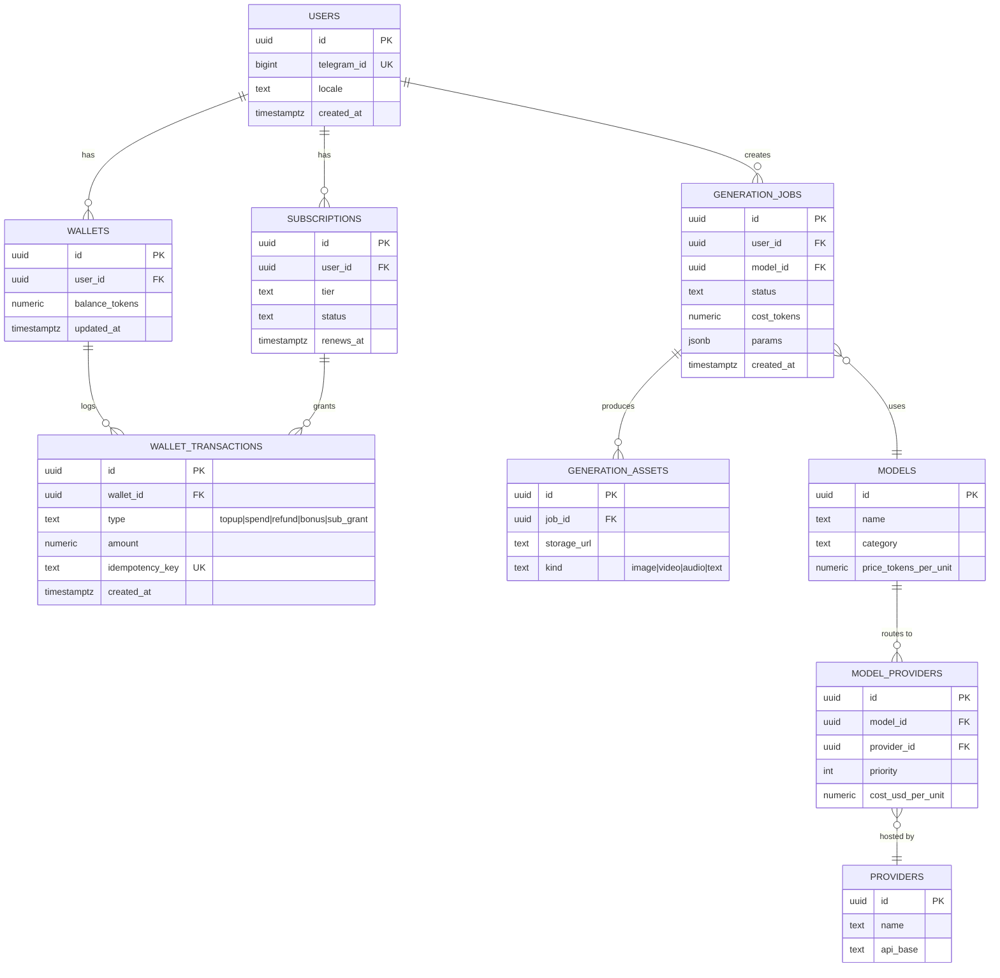

# Этап 3 — Предлагаемая техническая архитектура собственного продукта

Это архитектура **нашего** будущего продукта (рабочее имя ниже — "Nusa AI", placeholder), спроектированная так, чтобы быть проще в эксплуатации, чем то, что мы реконструировали у SYNTX (см. `01-reverse-engineering.md`), и оптимизированной для Telegram-first дистрибуции на рынок Индонезии.

Статус: **[EST]** — это предложение архитектуры, не факт о SYNTX. Опирается на индустриальные паттерны (Telegram Bot API, fal.ai/OpenRouter как в текущем стеке Mango Studio, Supabase) и на опыт, уже накопленный в этом репозитории (`apps/web`, `packages/core`, `packages/db`, fal.ai + OpenRouter интеграция).

## 3.1 Принципы

1. **Telegram как основной канал** — Mini App + Bot вместо отдельного мобильного приложения. Снижает CAC и обходит App Store/Play Store комиссии (30%) и модерацию генеративного контента.
2. **AI Gateway как единая точка входа к моделям** — все вызовы к внешним AI-провайдерам идут через один внутренний сервис с логированием стоимости, ретраями, фолбэком между провайдерами и рейт-лимитами. Это то место, где произошли реальные инциденты в Mango Studio (см. `git log`: `fal ffmpeg`, `queue status → pending`, `atomic finalize`) — типовой источник багов в таких системах, поэтому закладываем его как первоклассный компонент, а не рядовой fetch-вызов.
3. **Wallet/Billing отделены от Generation** — баланс токенов и биллинг — это транзакционная система (Postgres + RLS), генерация — это очередь с воркерами. Разделение убирает риск гонок (race condition), с которым уже сталкивался этот проект (`c1adbef hotfix(data-loss): mirror jsonb write-back race lost scene versions`).
4. **Идемпотентность и Outbox** — каждый платёж и каждая генерация имеют идемпотентный ключ; списание токенов и постановка задачи в очередь происходят в одной транзакции (outbox pattern), чтобы не терять и не дублировать списания при сбое воркера.
5. **Мультипровайдерность на уровне конфигурации, не кода** — каждая модель (Flux, Kling, GPT, Claude и т.д.) регистрируется в реестре моделей с 1..N бэкендами-провайдерами и правилом выбора (цена/скорость/доступность), чтобы менять провайдера без релиза.

## 3.2 Диаграмма компонентов (C2)

## 3.3 User flow — генерация изображения (пример)

## 3.4 Схема данных (ER, ключевые сущности)

## 3.5 Разбивка по слоям (соответствие ТЗ)

| Слой | Технология (рекомендация) | Обоснование |
|---|---|---|
| **Frontend / Telegram Mini App** | React + Vite, Telegram WebApp SDK, Tailwind | Быстрый старт, соответствует уже используемому в Mango Studio Next.js/Tailwind стеку по духу |
| **Telegram Bot** | Node.js (grammY или Telegraf) как отдельный сервис | Отделён от Mini App backend, чтобы webhook-нагрузка бота не блокировала API |
| **Backend Core / API Gateway** | Next.js API routes или отдельный Fastify/NestJS сервис | В текущем репо уже Next.js API routes (`apps/web`) — можно переиспользовать паттерн, но при росте нагрузки вынести generation-api в отдельный сервис |
| **AI Gateway** | Собственный TS/Python сервис-обёртка над fal.ai/OpenRouter/Replicate/etc | Централизует стоимость, ретраи, фолбэк — критично после инцидентов с "fal ffmpeg", "queue status pending" в текущем проекте |
| **Queue** | Redis Streams (старт) → SQS/Kafka (масштаб) | Redis уже используется как кэш/rate-limit, можно переиспользовать инфраструктуру на старте, не вводя лишний сервис |
| **Workers** | Node.js/Python worker pool, авто-скейл по длине очереди | Разделение по типу job (image/video/audio/text) — video job тяжелее и дольше |
| **Billing & Wallet** | Postgres + RLS (как уже в `supabase/migrations`), строгая транзакционность | В репо уже есть паттерн `billing_payments`, `MOCK_YOOKASSA` — переносим на индонезийские платёжные рельсы (Midtrans/Xendit) |
| **Object Storage** | S3-compatible (Supabase Storage на старте → Cloudflare R2/AWS S3 при росте, дешевле egress) | Media (фото/видео) — основной драйвер объёма хранилища |
| **CDN** | Cloudflare | Дёшево, глобальный edge, важно для латентности в Индонезии (Jakarta PoP) |
| **Database** | PostgreSQL (Supabase managed на старте) | Уже отработанный стек в этом репо, RLS даёт multi-tenant безопасность "из коробки" |
| **Vector DB** | pgvector расширение в том же Postgres | Не нужен отдельный сервис (Pinecone/Weaviate) при объёме <10M векторов — экономия инфраструктуры |
| **Monitoring** | Sentry (ошибки) + Grafana/Prometheus или Better Stack (метрики) | Полезность подтверждена историей репо — множество hotfix-коммитов про "atomic finalize", "poller stop being blind" указывают, что observability должен быть заложен с первого дня, а не добавлен постфактум |
| **Analytics** | PostHog (self-host опция снимает вопрос экспорта данных пользователей Индонезии за рубеж) | Учитывает требования локализации данных (см. `10-recommendations.md` про UU PDP) |
| **Admin Panel** | Next.js внутреннее приложение поверх тех же API | Управление моделями/ценами/промо без деплоя |
| **CI/CD** | GitHub Actions → Vercel (frontend) + Fly.io/Railway/Hetzner (workers, stateful) | В репо уже `.vercelignore`, значит Vercel — текущий выбор для web; воркеры и GPU-часть требуют non-serverless хостинга |

## 3.6 Почему не как у SYNTX (предположительно)

По косвенным признакам (см. `01-reverse-engineering.md`) SYNTX, вероятно, использует монолитный backend без выраженного AI Gateway слоя — отсюда типичные для таких продуктов проблемы: сложность добавления новых моделей, отсутствие единого контроля себестоимости в реальном времени, риск рассинхронизации баланса токенов при сбоях провайдера. Наша архитектура целенаправленно выносит это в отдельные слои (AI Gateway, Wallet-as-ledger с idempotency), чтобы:

1. Новую модель можно было подключить конфигурацией (запись в `MODEL_PROVIDERS`), а не кодом.
2. Списание токенов было строго консистентно с фактическим успехом/неудачей генерации (hold → commit/release).
3. Себестоимость по каждой генерации логировалась сразу (`cost_usd_per_unit` в `MODEL_PROVIDERS` + фактический ответ провайдера), что даёт данные для FinOps в реальном времени — то, что в Этапе 6 нам пришлось **оценивать** у SYNTX косвенно именно потому, что у них это внутренняя, непубличная система.
