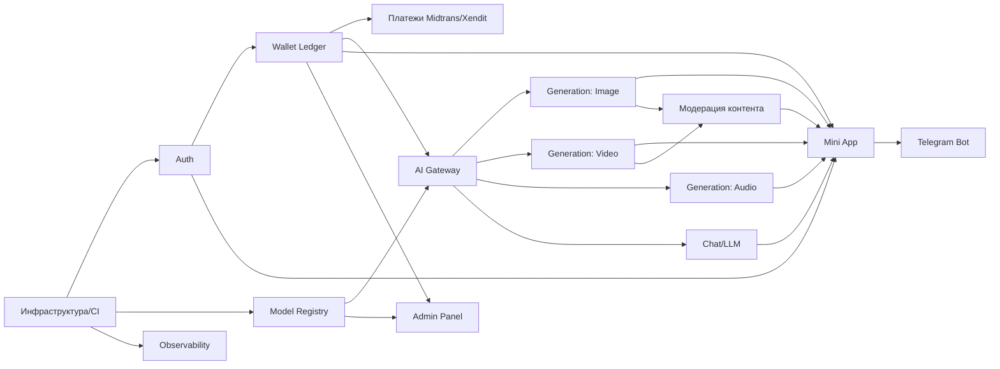

# Этап 8 — Roadmap разработки (AI-first)

## 8.1 Методология оценки

Классические оценки (человеко-месяцы по SCRUM-практике «доиндустриальной» разработки) здесь **не применяются**. Вместо этого оценка построена на наблюдаемой практике AI-first разработки в этом самом репозитории (`mango-studio`): судя по `git log`, полноценные фичи уровня "quota v5 rate-limit", "master-clip ffmpeg proxy", "workspace render-dashboard UX" поставляются как отдельные PR за 1 рабочую сессию с использованием Claude Code/Codex-подобных инструментов, включая ревью и хотфиксы. Это и есть эмпирическая база для оценок ниже — **[EST]**, откалибровано по факту истории коммитов этого проекта, а не по абстрактным AI-hype нормативам.

Единица измерения — **AI-дни**: один рабочий день одного AI-first инженера (человек + Claude Code/Codex/Cursor в агентном режиме), включающий: спеку → имплементацию → самопроверку/тесты → код-ревью (в т.ч. вторым AI-агентом, как делает этот проект — см. упоминания "Codex audit" в `HANDOFF.md`) → хотфиксы первого дня после деплоя.

**Допущение [EST], основанное на истории репозитория:** 1 AI-first инженер с Claude Code закрывает 1 "фичу среднего размера" (аналог одного из коммитов вида `feat(...)` в этом логе) за 0.5–2 дня, включая типичный шлейф из 1-3 хотфиксов, которые видны в этом же логе (`hotfix(fal)`, `hotfix(data-loss)`, `hotfix(scene-video)`). То есть реальная AI-first скорость уже включает в оценку "стоимость багов", а не только "счастливый путь".

Три сценария команды:
- **S1 — 1 сильный AI-first разработчик** (соло, полный стек, использует Claude Code + Codex как второй ревьюер)
- **S2 — 2 разработчика** (параллелизация независимых модулей, взаимное ревью)
- **S3 — небольшая команда (4-5 чел.: 2 backend/AI, 1 frontend/Mini App, 1 DevOps/FinOps part-time, 1 продукт/QA part-time)**

Для каждого модуля: **минимум** (всё идёт гладко, нет интеграционных сюрпризов), **реалистично** (типичный AI-first проект, 1-2 итерации ревью, часть решений меняется по ходу), **пессимистично** (внешний API нестабилен/меняет контракт, нужен redesign схемы данных, как это уже случалось в этом репо — см. `c1adbef` про гонку в jsonb write-back).

## 8.2 Оценка по модулям (в AI-днях, соло AI-first разработчик = базовая единица)

| Модуль | Мин. (дни) | Реалистично (дни) | Пессимистично (дни) | Комментарий |
|---|---:|---:|---:|---|
| Инфраструктура проекта (monorepo, CI/CD, окружения, линт/тесты) | 2 | 4 | 7 | Аналог "Phase 0" в этом же репо — там это заняло примерно один цикл до тега |
| Auth (Telegram initData + опционально web OTP) | 2 | 4 | 8 | В этом репо Phase 1.6 "identity" — 30 задач/8 суб-фаз, но с учётом SMTP/DNS вручную; для Telegram-only auth заметно проще |
| Wallet & Billing ledger (hold/commit/refund, idempotency) | 3 | 6 | 12 | Самый рискованный модуль — гонки состояний уже случались в этом репо несколько раз (`c1adbef`, `a217632`, refund-safety `58b00f3`) |
| Платёжная интеграция (Midtrans/Xendit, QRIS, GoPay/OVO/DANA) | 3 | 6 | 12 | Аналог YooKassa-интеграции в этом репо (`d92820e`, `58b00f3`) — новый провайдер, новая песочница, новые edge cases возврата |
| Model Registry / Catalog | 1 | 3 | 5 | Конфигурационная сущность, низкий риск |
| AI Gateway (унифицированный клиент, ретраи, фолбэк, cost logging) | 4 | 8 | 15 | В этом репо аналогичные проблемы стоили нескольких hotfix-PR (`4353d62` "missing queue status", `2250eab` "signed-URL proxy") — закладываем это в оценку с запасом |
| Generation API + Queue + Workers (image) | 3 | 6 | 10 | — |
| Generation API + Queue + Workers (video, включая long-running job UX) | 5 | 10 | 18 | Видео — самый сложный поток по опыту этого репо (`master-clip`, `scene-video` — источник большинства hotfix-коммитов в приведённой истории) |
| Generation (audio/voice) | 2 | 4 | 8 | Проще видео, но есть нюансы голосового пула — см. `voices.md`, `voice-pool-verify.sh` в этом репо |
| Чат/LLM интеграция (мультимодельный чат, RAG опционально) | 2 | 5 | 9 | При отсутствии RAG — просто; с pgvector RAG — сложнее |
| Telegram Mini App (UI, вся генерация, история, баланс) | 5 | 10 | 18 | Основной пользовательский поверхность продукта |
| Telegram Bot (команды, уведомления, webhook) | 2 | 4 | 7 | — |
| История генераций, медиатека, шаринг | 2 | 4 | 7 | — |
| Admin Panel | 2 | 5 | 9 | Управление моделями/ценами/промо/банами |
| Observability (логи, метрики, алерты, Sentry) | 2 | 4 | 6 | Критично закладывать заранее — см. `026be20`, `7c7f7d9` "capture raw poll exception details" в этом репо, где отсутствие этого стоило отдельных PR постфактум |
| Аналитика продукта (события, воронки) | 1 | 3 | 5 | — |
| Локализация (Bahasa Indonesia + English) | 1 | 3 | 5 | Тексты, форматы чисел/валют, RTL не требуется |
| Compliance/юр. (ToS, Privacy, UU PDP-совместимость, возрастные ограничения генерации) | 2 | 4 | 8 | Не чисто инженерная задача, но требует интеграции в продукт (age-gate, content moderation hooks) |
| Модерация контента (NSFW-фильтр на вход/выход) | 2 | 4 | 8 | Обязательно при консьюмерской генерации изображений/видео — регуляторный и репутационный риск |
| QA / нагрузочное тестирование / security review | 2 | 5 | 9 | — |
| **ИТОГО (соло, AI-first, дни)** | **48** | **102** | **186** | |

## 8.3 Пересчёт на календарные сроки по сценариям команды

Допущения:
- Соло-разработчик не работает 7 дней в неделю бесконечно — берём эффективные 20 рабочих AI-дней в месяц.
- S2 (2 разработчика) даёт не x2 скорость, а **x1.6** из-за координационных издержек и последовательных зависимостей (Wallet должен быть готов до полноценного тестирования Billing-интеграции, AI Gateway — до Workers) — типичный коэффициент параллелизации для тесно связанных модулей.
- S3 (команда 4-5 чел., из них ~2.5 FTE-эквивалента непосредственно кодящих с AI-инструментами + продукт/DevOps частично) даёт **x2.8** от соло за счёт возможности параллелить Mini App / Bot / Backend / Billing одновременно, но с оверхедом на координацию и ревью.

| Сценарий | Множитель скорости | Мин. (мес.) | Реалистично (мес.) | Пессимистично (мес.) |
|---|---:|---:|---:|---:|
| S1 — 1 разработчик | x1.0 | 48/20 ≈ **2.4** | 102/20 ≈ **5.1** | 186/20 ≈ **9.3** |
| S2 — 2 разработчика | x1.6 | 48/(20×1.6) ≈ **1.5** | 102/(20×1.6) ≈ **3.2** | 186/(20×1.6) ≈ **5.8** |
| S3 — команда 4-5 чел. | x2.8 | 48/(20×2.8) ≈ **0.9** | 102/(20×2.8) ≈ **1.8** | 186/(20×2.8) ≈ **3.3** |

**Рекомендация [EST]:** сценарий **S2 (2 разработчика)** — оптимальное соотношение скорость/риск/бюджет для MVP: реалистично **~3.2 месяца до пилотного запуска** (закрытый бета-тест в Telegram на ограниченную аудиторию Индонезии), **~5.8 месяцев** — консервативный сценарий с учётом рисков платёжной интеграции и видео-пайплайна (исторически самые проблемные зоны, судя по количеству hotfix-коммитов в этом репо на аналогичных модулях).

## 8.4 MVP vs Full Scope

Для запуска не нужен весь список из 8.2 — MVP может исключить: Vector DB/RAG в чате, полноценный Admin Panel (заменить на прямые SQL/консоль на старте), продвинутую аналитику, часть локализации (можно начать с Bahasa Indonesia + English без доп. языков).

**MVP-скоуп (реалистичная оценка, S2):** Auth (4) + Wallet (6) + платёжная интеграция Midtrans (6) + Model Registry (3) + AI Gateway (8) + Generation image (6) + Generation видео базовый (10) + Mini App (10) + Bot (4) + минимальный Admin/feature-flags (2, урезано от полного Admin Panel) + Observability (4) + модерация контента (4) + инфраструктура (4) ≈ **71 AI-день** реалистично → 71/(20×1.6) ≈ **2.2 месяца** при S2.

## 8.5 Диаграмма зависимостей модулей

## 8.6 Риски графика (переносится в `risk-assessment.md`)

Наибольшая историческая вероятность просрочки — Wallet/Billing ledger и Video generation pipeline: в этом самом репозитории именно эти два модуля дали наибольшее число hotfix-коммитов после первого релиза (гонки состояний, потерянные версии сцен, "queue status pending", refund-safety патчи). Закладывать в план **явный буфер 30-40%** именно на эти два модуля, а не равномерно по всему списку.
